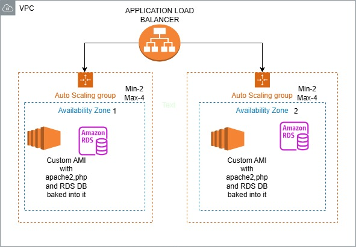
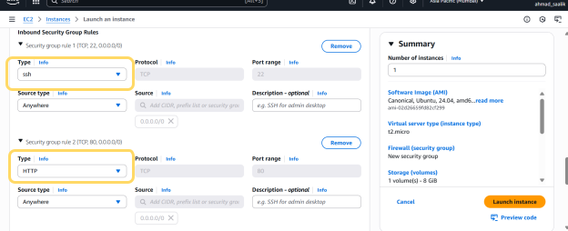
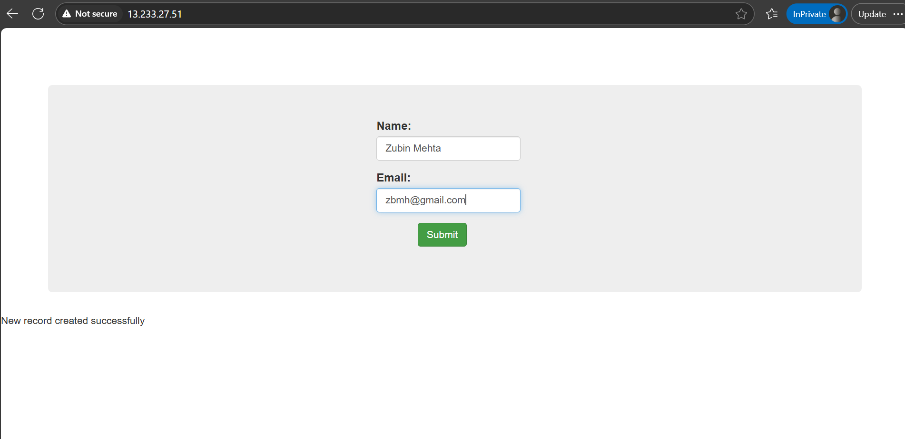
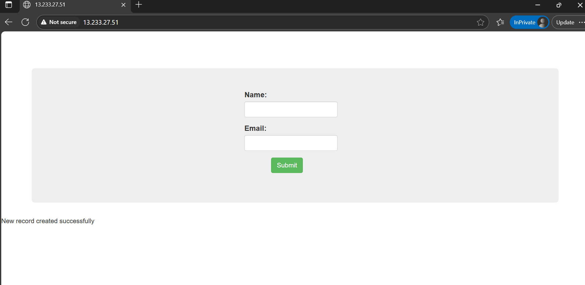
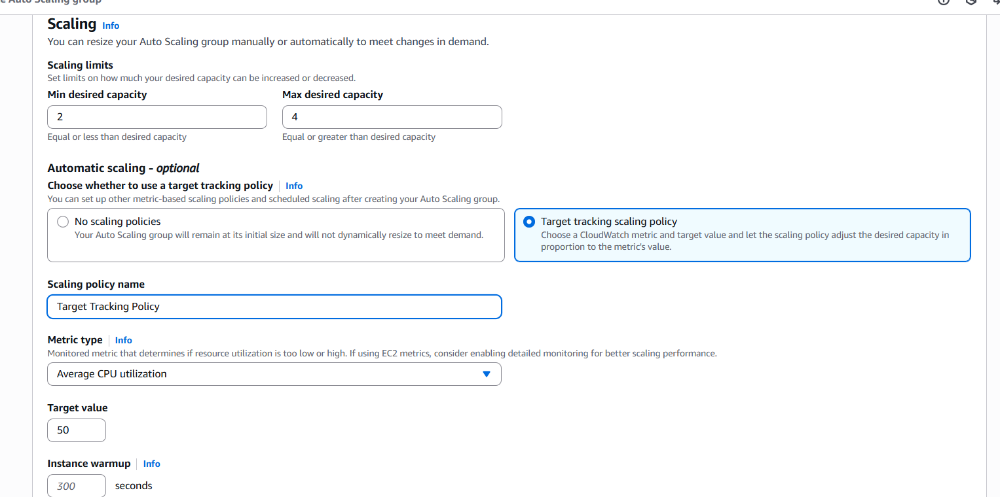
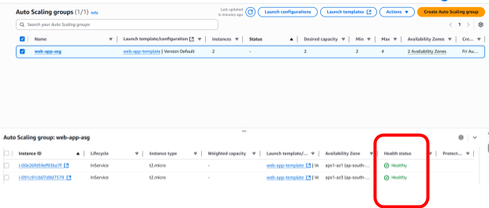
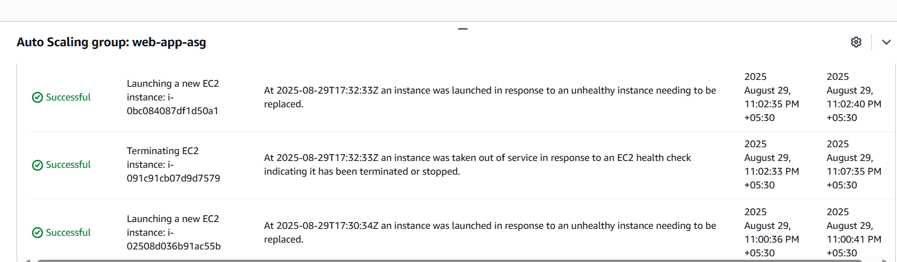

## aws-terraform-migration

Production-grade multi-tier AWS infrastructure automation: from manual EC2  deployment to fully automated Terraform IaC. Demonstrates high availability (Auto Scaling + multi-AZ), security hardening (least privilege + SG segmentation),  disaster recovery and cost optimization. Enterprise-ready with comprehensive  documentation and deployment guides.

#                                AWS Multi-Tier Architecture:
From Manual Console to Infrastructure as Code  
A Complete DevOps Transformation Story | Building production-grade infrastructure with AWS, Terraform, and best practices

## 📋 Project Overview  
This project demonstrates my journey from creating AWS infrastructure using console  to fully automating the  Infrastructure as Code (IaC) using Terraform. It showcases:

✅ End-to-end cloud architecture design  
✅ Production-grade high availability setup  
✅ Security best practices implementation  
✅ Infrastructure automation and repeatability  
✅ Cost optimization through proper resource configuration  

## The Objective
Migrating  PHP web application to AWS with the following requirements:

1)High Availability: No single point of failure  
2)Auto Scaling: Handle traffic spikes automatically
3)Secure Database: Isolated RDS instance accessible only from app servers  
4)Load Balancing: Distribute traffic across instances  

## 🏗️ Architecture Overview  
Architecture Diagram  


Security Groups:
* Web SG: Allow SSH (22), HTTP (80) from anywhere  
* DB SG: Allow MySQL (3306) only from Web SG  

## 🎯 Phase 1: Manual Console Approach (September 2025)

### AWS Services Used:  
* EC2 Compute Service: Instances , Security Groups , Application Load Balancer, Auto Scaling Groups
* RDS 

**Steps Completed**

### 1. Security Groups Configuration  
   
#### Web Server Security Group (web-app-server-sg):  
- **Inbound Rules:**  
     1) SSH (Port 22): 0.0.0.0/0 [LEARNING ONLY - Restrict in production]  
     2) HTTP (Port 80): 0.0.0.0/0  
* **Outbound Rules:** All traffic allowed  



#### Database Security Group (mysql-prod-db-sg):  
-  **Inbound Rules:**  
    MySQL (Port 3306): From web-server-sg only [KEY SECURITY PRINCIPLE]
-  **Outbound:** Deny all (Database doesn't need outbound) 

### 2. RDS MySQL Database Setup  
**AWS Service used: Aurora and RDS**  

Configuration:
* Engine: MySQL 8.0  
* Instance Class: db.t3.micro (Free tier eligible)  
* Storage: 10 GB (General Purpose SSD)  
* Database Name: mysql-db-prod  
* Master Username: admin  
* Master Password: intel123  
* Publicly Accessible: NO [Security Best Practice]  
* Multi-AZ: YES [High Availability]  
* Backup Retention: 7 days  

3. Launching an EC2 Instance in deafult VPC with web-server-sg Security group attached and User Data
```bash
#!/bin/bash
# Install Apache & PHP
sudo apt update -y && sudo apt upgrade -y
sudo apt install apache2 -y
sudo systemctl enable apache2
sudo systemctl start apache2

# Install PHP and MySQL driver
sudo apt install php libapache2-mod-php php-mysql -y
sudo systemctl restart apache2
```

4. SSH into the instance

5. Connecting to the RDS instance from the EC2 instance

```sh
mysql -h <RDS endpoint> -P 3306 -u <user_name> -p
```
On being prompted Enter the password: intel123  

6. mysql client is connected to the RDS instance. We execute commands to create a database and  table named “data”  
Commands executed:
 
```
CREATE DATABASE intel;
USE intel;

CREATE TABLE data (
    id INT AUTO_INCREMENT PRIMARY KEY,
    firstname VARCHAR(100) NOT NULL,
    email VARCHAR(255) NOT NULL,
    created_at TIMESTAMP DEFAULT CURRENT_TIMESTAMP
);
```
We can cross check whether the database and table was created by executing these commands:  
                                                                 
```
show databases;
use intel;
show tables;
describe data # To see the table schema
```


7. Since we have our database ready along with the table , we make changes to our index.php file to ensure seamless connectivity with the database  

We scroll the PHP section of the index.php file and make following changes as per the credentials of our RDS instance   
servername= RDS Endpoint URL  
username= admin  
password=intel123  
db= intel  

The Rds instance is now connected with the index.php page . Next step involves browsing the webpage and making entries  

8. Copying the public IP of the instance , pasting it in the browser and then making entries

     

   

9. Our app’s frontend as well as the backend are totally integrated . Then i  created an image of our instance and  terminated it . The image will be used by the auto scaling group to launch instances as per the scaling policy
**IMAGE NAME**- app-server-image  

10. Application Load Balancer (ALB)
text
Configuration:
* Type: Application Load Balancer
* Scheme: Internet-facing  
* Subnets: All subnets in VPC  
* Target Group: web-app-tg (Port 80, HTTP)  
* Security Group: web-lb-sg  
* Listeners and routing : Protocol- HTTP ; Port-80 ; Default action- web-app-tg (target group)   
* Availability Zone: ap-south-1a, ap-south-1b (To avoid single point of failure)    
* Health Check: /index.php (30s interval)  
 
8. Auto Scaling Group (ASG)  
  
Configuration:  
* Launch template :A template is created with these details : AMI-app-server-image (The one which we created earlier) ;security group- web-app-server-sg   
* Availability Zones: ap-south-1a, ap-south-1b (This shoud be same as that in Application load balancer)  
* Integration of ASG with load balancer that was created by selecting the target group created earlier (web-app-tg)  
* Scaling Policy: (minimum-2 ; desired -2 ; maximum -4); Metric type -Average CPU utilization :50%



**Finally Auto scaling group is created . Once it is available , it adds targets on its own ( Note: I had terminated the EC2 instance earlier)**  
The targets added by Auto scaling group can be seen under Target group also. The status as healthy means they are up and working and the web based app can be accessed.  



**Note:** Inorder to test the working of auto scaling group ,we terminate one instance manually and we see a new instance spins up on its own  



Manual Approach - Key Learnings
Time Required: ~4 hours (including troubleshooting)

### Challenges Encountered:

* Security group rules took 30 minutes to understand
* Database hostname had to be manually typed in PHP config
* Testing auto-scaling required manual instance termination
* Documentation had to be done separately

### Pros:

✅ Deep understanding of each AWS service
✅ Visual interface makes learning easier
✅ Immediate feedback

### Cons:
❌ Not repeatable or version-controlled
❌ Risk of configuration drift
❌ Documentation is manual and often incomplete
❌ Difficult to replicate in another AWS account or region

🔧 Phase 2: Infrastructure as Code with Terraform
Why Terraform?
Aspect	Manual Console	Terraform
Deployment Time	4 hours	3 minutes
Repeatability	Manual each time	Single command
Version Control	Not possible	Git tracked
Documentation	Separate docs	Code is documentation
Rollback	Manual steps	terraform destroy
Drift Detection	Manual review	terraform plan
Team Collaboration	Error-prone	State file shared
Terraform Project Structure
text
aws-terraform-ecommerce/
├── main.tf                 # Core infrastructure code
├── variables.tf            # Input variables
├── outputs.tf              # Output values (ALB DNS, RDS endpoint, etc.)
├── terraform.tfvars        # Variable values
├── .gitignore              # Exclude sensitive files
├── README.md               # This file
└── docs/
    ├── ARCHITECTURE.md
    ├── DEPLOYMENT.md
    └── TROUBLESHOOTING.md
Terraform Code Breakdown
1. Provider Configuration
text
provider "aws" {
  region = "ap-south-1"  # Mumbai region
}
2. Data Sources (Referencing Existing Resources)
text
data "aws_vpc" "default" {
  default = true  # Use default VPC
}

data "aws_subnets" "default" {
  filter {
    name   = "vpc-id"
    values = [data.aws_vpc.default.id]  # All subnets in default VPC
  }
}
3. Security Groups
text
# Web Server Security Group
resource "aws_security_group" "web_sg" {
  name        = "web-server-sg"
  description = "Allow HTTP and SSH"
  vpc_id      = data.aws_vpc.default.id

  ingress {
    description = "SSH"
    from_port   = 22
    to_port     = 22
    protocol    = "tcp"
    cidr_blocks = ["0.0.0.0/0"]  # ⚠️ Restrict to your IP in production
  }

  ingress {
    description = "HTTP"
    from_port   = 80
    to_port     = 80
    protocol    = "tcp"
    cidr_blocks = ["0.0.0.0/0"]
  }

  egress {
    from_port   = 0
    to_port     = 0
    protocol    = "-1"
    cidr_blocks = ["0.0.0.0/0"]
  }
}

# Database Security Group
resource "aws_security_group" "db_sg" {
  name        = "mysql-prod-db-sg"
  description = "Allow MySQL from Web SG only"
  vpc_id      = data.aws_vpc.default.id

  ingress {
    description     = "MySQL access from EC2"
    from_port       = 3306
    to_port         = 3306
    protocol        = "tcp"
    security_groups = [aws_security_group.web_sg.id]  # SG-to-SG rule
  }
}
4. RDS MySQL Instance
text
resource "aws_db_instance" "default" {
  allocated_storage      = 10
  db_name                = "intel"
  engine                 = "mysql"
  engine_version         = "8.0"
  instance_class         = "db.t3.micro"
  username               = "admin"
  password               = "intel123456"  # Use variables in production!
  parameter_group_name   = "default.mysql8.0"
  skip_final_snapshot    = true
  publicly_accessible    = false
  vpc_security_group_ids = [aws_security_group.db_sg.id]
}
5. Launch Template (EC2 Blueprint)
text
resource "aws_launch_template" "web_config" {
  name_prefix   = "web-server-lt"
  image_id      = "ami-0dee22c13ea7a9a67"  # Ubuntu 24.04 LTS (ap-south-1)
  instance_type = "t2.micro"

  vpc_security_group_ids = [aws_security_group.web_sg.id]

  user_data = base64encode(<<-EOF
              #!/bin/bash
              sudo apt update -y && sudo apt upgrade -y
              sudo apt install apache2 -y
              sudo systemctl enable apache2
              sudo systemctl start apache2
              sudo apt install php libapache2-mod-php php-mysql -y
              sudo systemctl restart apache2
              echo "<?php phpinfo(); ?>" > /var/www/html/index.php
              rm /var/www/html/index.html
              EOF
  )
}
6. Application Load Balancer
text
resource "aws_lb" "web_lb" {
  name               = "web-app-lb"
  internal           = false
  load_balancer_type = "application"
  security_groups    = [aws_security_group.web_sg.id]
  subnets            = data.aws_subnets.default.ids
}

resource "aws_lb_target_group" "web_tg" {
  name     = "web-app-tg"
  port     = 80
  protocol = "HTTP"
  vpc_id   = data.aws_vpc.default.id
  
  health_check {
    path                = "/index.php"
    healthy_threshold   = 2
    unhealthy_threshold = 2
    timeout             = 3
    interval            = 30
  }
}

resource "aws_lb_listener" "front_end" {
  load_balancer_arn = aws_lb.web_lb.arn
  port              = "80"
  protocol          = "HTTP"

  default_action {
    type             = "forward"
    target_group_arn = aws_lb_target_group.web_tg.arn
  }
}
7. Auto Scaling Group
text
resource "aws_autoscaling_group" "web_asg" {
  desired_capacity    = 2
  max_size            = 3
  min_size            = 2
  vpc_zone_identifier = data.aws_subnets.default.ids
  target_group_arns   = [aws_lb_target_group.web_tg.arn]

  launch_template {
    id      = aws_launch_template.web_config.id
    version = "$Latest"
  }

  # Auto-healing configuration
  health_check_type         = "ELB"
  health_check_grace_period = 90
}
🚀 Deployment Guide
Prerequisites
bash
# 1. Install Terraform
# Download from https://www.terraform.io/downloads

# 2. Configure AWS Credentials
aws configure
# Enter: AWS Access Key ID, Secret Access Key, Region (ap-south-1)

# 3. Verify installation
terraform --version
aws --version
Step-by-Step Deployment
Step 1: Initialize Terraform
bash
terraform init
What it does:

Downloads AWS provider plugin

Creates .terraform/ directory

Initializes state management

Step 2: Validate Configuration
bash
terraform validate
Expected output:

text
Success! The configuration is valid.
Step 3: Review Planned Changes
bash
terraform plan
Expected output:

text
Plan: 14 to add, 0 to change, 0 to destroy.
Step 4: Apply Infrastructure
bash
terraform apply
Confirm: Type yes when prompted

Expected output:

text
Apply complete! Resources: 14 added, 0 changed, 0 destroyed.

Outputs:
load_balancer_dns = "web-app-lb-1234567890.ap-south-1.elb.amazonaws.com"
rds_endpoint = "terraform-20251215123456.abc123.ap-south-1.rds.amazonaws.com:3306"
Step 5: Verify Deployment
bash
# Get ALB DNS
terraform output load_balancer_dns

# Test the web server
curl http://web-app-lb-1234567890.ap-south-1.elb.amazonaws.com/index.php
🔍 Testing & Validation
1. Load Balancer Health Check
bash
# SSH into one instance and check Apache
ssh -i your-key.pem ubuntu@instance-ip
sudo systemctl status apache2
2. Database Connectivity
bash
# From EC2 instance
mysql -h terraform-20251215123456.abc123.ap-south-1.rds.amazonaws.com -u admin -p
# Enter password: intel123456
# Test: SHOW DATABASES;
3. Auto-Scaling Verification
bash
# Terminate an instance and watch ASG replace it
aws ec2 describe-instances | grep "InstanceId"
aws ec2 terminate-instances --instance-ids i-1234567890abcdef0

# In 2-3 minutes, a new instance should launch
4. Health Checks
bash
# View target group health
aws elbv2 describe-target-health --target-group-arn arn:aws:elasticloadbalancing:...
💰 Cost Estimation
Resource	Hourly Cost	Monthly Cost
EC2 t2.micro (x2)	$0.01 × 2	~$14
RDS db.t3.micro	$0.02	~$15
ALB	$0.0225	~$16
Total	~$0.05	~$45
Note: First 12 months qualify for AWS Free Tier (eligible for $0 cost)

🛑 Cleanup (Destroy Infrastructure)
bash
# Review what will be deleted
terraform plan -destroy

# Delete all resources
terraform destroy
Confirm: Type yes when prompted

🎓 Key Learnings
Security Best Practices Implemented
✅ Principle of Least Privilege - DB access restricted to EC2 SG only
✅ No Hardcoded Passwords - Use AWS Secrets Manager in production
✅ Multi-AZ Deployment - High availability across zones
✅ Security Groups as Firewall - Restrict SSH to known IPs in production
✅ Database Backup - 7-day retention enabled

DevOps Principles Demonstrated
✅ Infrastructure as Code - All resources defined in code
✅ Version Control - Terraform files in Git
✅ Automation - Single terraform apply deploys entire stack
✅ Idempotency - Apply multiple times without issues
✅ Documentation - Code is self-documenting

Scalability Features
✅ Auto Scaling - Automatic capacity adjustment
✅ Load Balancing - Traffic distributed across instances
✅ Health Checks - Failed instances automatically replaced
✅ Multi-AZ - Availability zone redundancy

🔧 Production Enhancements
To make this production-ready, add:

1. Variables Management
text
# variables.tf
variable "instance_count" {
  default = 2
}

variable "database_password" {
  sensitive = true
  # Provide via terraform.tfvars or environment variable
}
2. HTTPS/SSL Certificate
text
# Add ACM certificate and update ALB listener to 443
resource "aws_acm_certificate" "example" {
  domain_name       = "yourdomain.com"
  validation_method = "DNS"
}
3. Terraform Backend (Remote State)
text
# backend.tf
terraform {
  backend "s3" {
    bucket         = "my-terraform-state"
    key            = "aws-infra/terraform.tfstate"
    region         = "ap-south-1"
    encrypt        = true
    dynamodb_table = "terraform-lock"
  }
}
4. CloudWatch Monitoring
text
# monitoring.tf
resource "aws_cloudwatch_metric_alarm" "cpu_high" {
  alarm_name          = "web-server-cpu-high"
  comparison_operator = "GreaterThanThreshold"
  evaluation_periods  = "1"
  metric_name         = "CPUUtilization"
  period              = "300"
  statistic           = "Average"
  threshold           = "80"
}
📚 Resources & References
Official Documentation
AWS EC2 Documentation

Terraform AWS Provider

AWS RDS Best Practices

Learning Materials
Terraform State Deep Dive

AWS Security Best Practices

Auto Scaling Groups Guide

Tools Used
Terraform v1.0+

AWS CLI v2

Git for version control

VS Code for editing

🤝 Contributing & Feedback
**This project demonstrates my understanding of:**   
- **Cloud architecture design**    
- **Infrastructure automation**  
- **Security best practices**  
- **Scalability & high availability**  
- **DevOps principles**

Improvements welcome! Feel free to suggest enhancements via GitHub issues.

## 👤 About This Project

- **Built by:** Ahmad Saalik Hussain
- **Date:** December 2025
- **Status:** ✅ Complete & Production-Ready
- **License:** MIT


📞 Contact & Links
## Connect with me
[](https://www.linkedin.com/in/ahmad-saalik-hussain)


GitHub: 

Email: [Your Email]

Last Updated: December 15, 2025
Version: 2.0 (IaC with Terraform)

