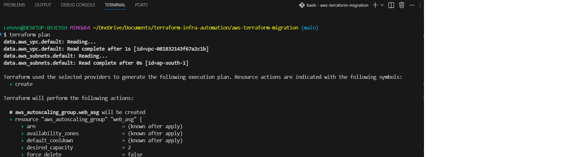
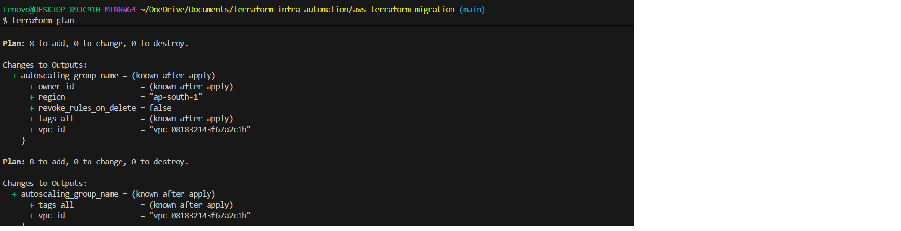
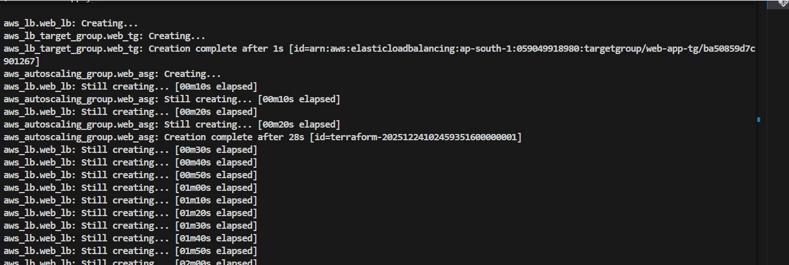
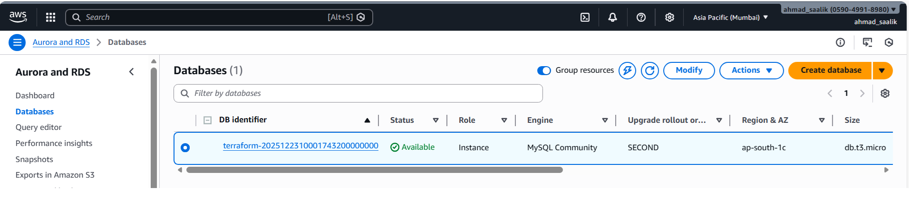
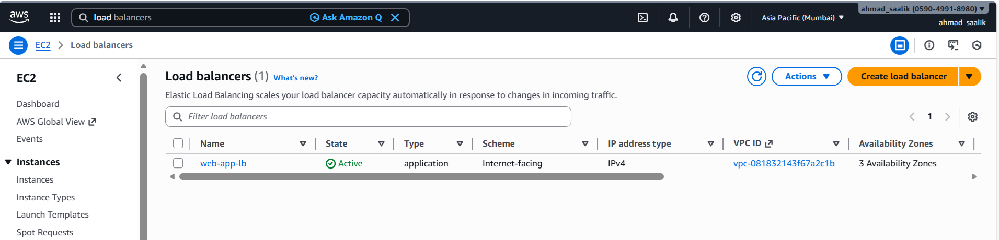
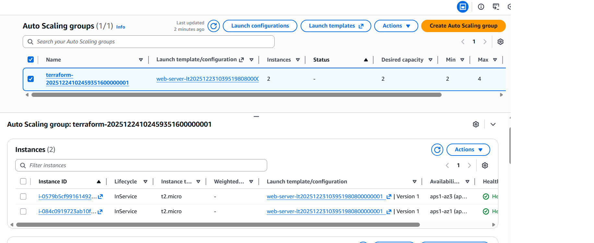
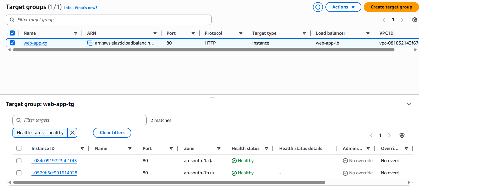
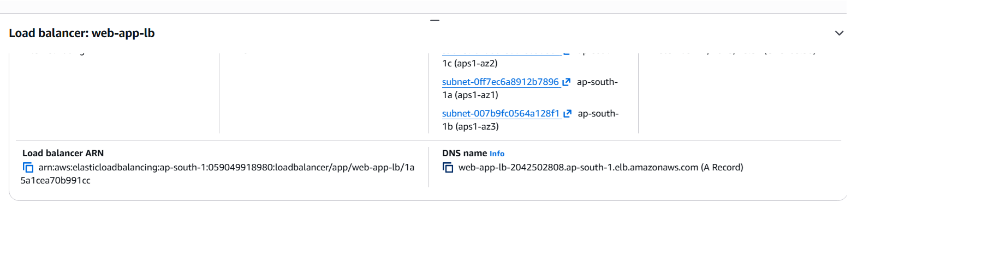
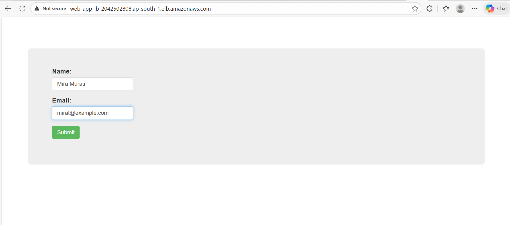
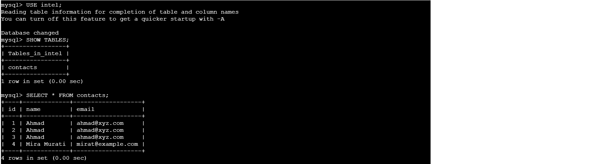

## aws-terraform-migration

Production-grade multi-tier AWS infrastructure automation: from manual EC2  deployment to fully automated Terraform IaC. Demonstrates high availability (Auto Scaling + multi-AZ), security hardening (least privilege + SG segmentation),  disaster recovery and cost optimization. Enterprise-ready with comprehensive  documentation and deployment guides.

#                                AWS Multi-Tier Architecture:
From Manual Console to Infrastructure as Code  
A Complete DevOps Transformation Story | Building production-grade infrastructure with AWS, Terraform, and best practices

##  Project Overview  
This project demonstrates my journey from creating AWS infrastructure using console  to fully automating the  Infrastructure as Code (IaC) using Terraform. It showcases:

- End-to-end cloud architecture design  
- Production-grade high availability setup  
- Security best practices implementation  
- Infrastructure automation and repeatability  
- Cost optimization through proper resource configuration  

## The Objective
Migrating  PHP web application to AWS with the following requirements:

1)High Availability: No single point of failure  
2)Auto Scaling: Handle traffic spikes automatically
3)Secure Database: Isolated RDS instance accessible only from app servers  
4)Load Balancing: Distribute traffic across instances  

##  Architecture Overview  
Architecture Diagram  


## 🛠️ Tech Stack

| Category | Technologies Used |
|----------|-------------------|
| **Cloud Provider** | AWS (EC2, VPC, RDS, ALB, ASG, Security Groups) |
| **Infrastructure as Code** | Terraform, HCL |
| **Scripting** | Bash (User Data) |
| **Web Server** | Apache HTTP Server |
| **Application Runtime** | PHP, MySQL (mysqli extension) |
| **Frontend** | HTML5, Bootstrap 3 |
| **Version Control** | Git, GitHub |


## 🎯 Phase 1: Manual Console Approach (September 2025)

### AWS Services Used:  
* EC2 Compute Service: Instances , Security Groups , Application Load Balancer, Auto Scaling Groups
* RDS 

### Steps Completed  

### 1. Security Groups Configuration  
   
#### Web Server Security Group (web-app-server-sg):  
- **Inbound Rules:**  
     1) SSH (Port 22): 0.0.0.0/0 [Restricted in production]  
     2) HTTP (Port 80): 0.0.0.0/0  
* **Outbound Rules:** All traffic allowed  


#### Database Security Group (mysql-prod-db-sg):  
-  **Inbound Rules:**  
    MySQL (Port 3306): From web-server-sg only [KEY SECURITY PRINCIPLE]
-  **Outbound:** Deny all (Database doesn't need outbound) 

### 2. RDS MySQL Database Setup  
**AWS Service used: Aurora and RDS**  

Configuration:
* Engine: MySQL 8.0  
* Instance Class: db.t3.micro (Free tier eligible)  
* Storage: 10 GB (General Purpose SSD)  
* Database Name: mysql-db-prod  
* Master Username: admin  
* Master Password: intel123  
* Publicly Accessible: NO [Security Best Practice]  
* Multi-AZ: YES [High Availability]  
* Backup Retention: 7 days  

3. Launching an EC2 Instance in deafult VPC with web-server-sg Security group attached and User Data
```bash
#!/bin/bash
# Install Apache & PHP
sudo apt update -y && sudo apt upgrade -y
sudo apt install apache2 -y
sudo systemctl enable apache2
sudo systemctl start apache2

# Install PHP and MySQL driver
sudo apt install php libapache2-mod-php php-mysql -y
sudo systemctl restart apache2
```

4. SSH into the instance

5. Connecting to the RDS instance from the EC2 instance

```sh
mysql -h <RDS endpoint> -P 3306 -u <user_name> -p
```
On being prompted Enter the password: intel123  

6. mysql client is connected to the RDS instance. We execute commands to create a database and  table named “data”  
Commands executed:
 
```
CREATE DATABASE intel;
USE intel;

CREATE TABLE data (
    id INT AUTO_INCREMENT PRIMARY KEY,
    firstname VARCHAR(100) NOT NULL,
    email VARCHAR(255) NOT NULL,
    created_at TIMESTAMP DEFAULT CURRENT_TIMESTAMP
);
```
We can cross check whether the database and table was created by executing these commands:  
                                                                 
```
show databases;
use intel;
show tables;
describe data # To see the table schema
```


7. Since we have our database ready along with the table , we make changes to our index.php file to ensure seamless connectivity with the database  

We scroll the PHP section of the index.php file and make following changes as per the credentials of our RDS instance   
servername= RDS Endpoint URL  
username= admin  
password=intel123  
db= intel  

The Rds instance is now connected with the index.php page . Next step involves browsing the webpage and making entries  

8. Copying the public IP of the instance , pasting it in the browser and then making entries

     

   

9. Our app’s frontend as well as the backend are totally integrated . Then i  created an image of our instance and  terminated it . The image will be used by the auto scaling group to launch instances as per the scaling policy
**IMAGE NAME**- app-server-image  

10. Application Load Balancer (ALB)
text
Configuration:
* Type: Application Load Balancer
* Scheme: Internet-facing  
* Subnets: All subnets in VPC  
* Target Group: web-app-tg (Port 80, HTTP)  
* Security Group: web-lb-sg  
* Listeners and routing : Protocol- HTTP ; Port-80 ; Default action- web-app-tg (target group)   
* Availability Zone: ap-south-1a, ap-south-1b (To avoid single point of failure)    
* Health Check: /index.php (30s interval)  
 
8. Auto Scaling Group (ASG)  
  
Configuration:  
* Launch template :A template is created with these details : AMI-app-server-image (The one which we created earlier) ;security group- web-app-server-sg   
* Availability Zones: ap-south-1a, ap-south-1b (This shoud be same as that in Application load balancer)  
* Integration of ASG with load balancer that was created by selecting the target group created earlier (web-app-tg)  
* Scaling Policy: (minimum-2 ; desired -2 ; maximum -4); Metric type -Average CPU utilization :50%


**Finally Auto scaling group is created . Once it is available , it adds targets on its own ( Note: I had terminated the EC2 instance earlier)**  
The targets added by Auto scaling group can be seen under Target group also. The status as healthy means they are up and working and the web based app can be accessed.  


**Note:** Inorder to test the working of auto scaling group ,we terminate one instance manually and we see a new instance spins up on its own  


Manual Approach - Key Learnings
Time Required: ~4 hours (including troubleshooting)

### Challenges Encountered:

* Security group rules took 30 minutes to understand
* Database hostname had to be manually typed in PHP config
* Testing auto-scaling required manual instance termination
* Documentation had to be done separately

### Pros:

✅ Deep understanding of each AWS service  
✅ Visual interface makes learning easier  
✅ Immediate feedback  

### Cons:  
❌ Not repeatable or version-controlled  
❌ Risk of configuration drift  
❌ Documentation is manual and often incomplete  
❌ Difficult to replicate in another AWS account or region  

# Phase 2: Infrastructure as Code with Terraform  
## Why Terraform?

## Console vs Terraform

| Aspect              | Manual using Console   | Terraform              |
|---------------------|------------------------|------------------------|
| Deployment Time     | 4 hours                | 3 minutes              |
| Repeatability       | Manual each time       | Single command         |
| Version Control     | Not possible           | Git tracked            |
| Documentation       | Separate docs          | Code is documentation  |
| Rollback           | Manual steps           | `terraform destroy`    |
| Drift Detection     | Manual review          | `terraform plan`       |
| Team Collaboration  | Error-prone            | State file shared      |

### Terraform Project Structure  

**aws-terraform-migration/**  
- provider.tf               # Configures cloud provider (AWS), region, and other config  
- main.tf                   # Core infrastructure code  
- variables.tf              # Input variables  
- outputs.tf                # Output values (ALB DNS, RDS endpoint, etc.)  
- .gitignore                # Exclude sensitive files  
-  README.md                # This file  
└── docs
    ├── ARCHITECTURE.md
    ├── DEPLOYMENT.md
    └── TROUBLESHOOTING.md

##  Terraform Configuration

This project uses modular Terraform files for infrastructure-as-code:

| File | Purpose |
|------|---------|
| `provider.tf` | AWS provider configuration and region setup |  
| `main.tf` | Core resources (VPC, security groups, RDS, ALB, ASG, launch template) |  
| `variables.tf` | Input variables for customization (instance type, DB name, etc.) |  
| `outputs.tf` | Exported values (ALB DNS, RDS endpoint, ASG name) |  
| `userscript.sh` | Installs Apache, PHP, MySQL client. Creates DB config from Terraform variables. Deploys HTML form that inserts user data (name, email) into RDS MySQL                       database. Auto-creates table if missing.|    

### Key Architecture Components  

- **Security Groups**: Separate SGs for web tier (HTTP/SSH) and database tier (MySQL 3306)  
- **RDS MySQL**: Multi-AZ capable, encrypted, non-publicly accessible  
- **Application Load Balancer**: Routes traffic to healthy EC2 instances  
- **Auto Scaling Group**: Maintains 2–4 EC2 instances with health checks  
- **Launch Template**: Ubuntu 24.04 LTS with Apache, PHP, and MySQL libraries  

Note: All infrastructure is deployed in the default VPC with automatic resource scaling and self-healing enabled.


### 🚀 Deployment Guide  

I used Visual Studio as my IDE which was integrated with terraform's latest version to write my code. I used git-bash as my terminal under Visual Code . I also cloned my github repo and pushed code after testing which helped me keep a track and version control it.
## Prerequisites  
**1. Terraform installed on the system based on the OS**  
Download from https://developer.hashicorp.com/terraform/install  

**2. Configure AWS Credentials under the git-bash terminal of Visual Studio**   
```bash
aws configure
```    
Enter: AWS Access Key ID, Secret Access Key, Region (ap-south-1)

**3. Verify installation**   
```bash 
terraform --version   
aws --version
```    


## **Step-by-Step Deployment**   
**Step 1: Initialize Terraform**
   
```bash 
terraform init
```  
What it does:

- Downloads AWS provider plugin   
- Creates .terraform/ directory  
- Initializes state management  

**Step 2: Validate Configuration**  

```bash
terraform validate
```
Expected output:

Success! The configuration is valid.  

**Step 3: Review Planned Changes**

```bash 
terraform plan  
```
It shows the list of resources that are planned to be created or updated or deleted along with their configuration
**Expected output:**






Plan: 8 to add, 0 to change, 0 to destroy.  


**Step 4: Apply Infrastructure**  
```bash
terraform apply
```  
Confirm: Type yes when prompted  

Expected output: 

  

Apply complete! Resources: 8 added, 0 changed, 0 destroyed.

Outputs:
  

**Step 5: Verifying Deployment**

#### Checking for all the resources from the AWS console 
#### - Database
  

#### - Load Balancer


#### - Auto-scaling groups  (the ec2 instances that are set up automatically are also seen)
 

#### - Target Groups
The targets registered by Auto scaling groups is also visible
  

 
#### Testing the web server
- Copying the Load Balancer DNS and pasting it in browser. This opens the custom web page.Then a entry is made into it,which will be tested by connecting to the database from the EC2 instance
- 




  
### Testing & Validation  
**1. Database Connectivity**

- SSH into the EC2 instance
- Execute these commands:
```bash
sudo apt update
sudo apt install -y mysql-client
```
- Connecting to the RDS endpoint;
```bash
mysql -h <rds-endpoint> -u <db_username> -p 
```
- Enter the password when prompted
- Quering the database using these commands
```bash
USE intel;
SHOW TABLES;
SELECT * FROM contacts;
```



**2. Auto-Scaling Verification**
On Terminating an instance , ASG replaces it with a new one


### **Cost Estimation**
#### Estimated Cost Breakdown

| Resource | Configuration | Hourly Cost | Monthly Cost (Est.) |
| :--- | :--- | :--- | :--- |
| **EC2 Instances** | 2x t2.micro | $0.0232 | ~$17.00 |
| **RDS Database** | 1x db.t3.micro | $0.0180 | ~$13.00 |
| **Application Load Balancer** | 1x ALB | $0.0225 | ~$16.50 |
| **Total** | | **~$0.06** | **~$46.50** |

Note: First 12 months qualify for AWS Free Tier (eligible for $0 cost)

### Cleanup (Destroy Infrastructure)

**Review what will be deleted**
```bash
terraform plan -destroy
```
**Delete all resources**
```bash
terraform destroy
```
Confirm: Type yes when prompted

## Key Learnings  
**Security Best Practices Implemented**   
- Principle of Least Privilege - DB access restricted to EC2 SG only  
- No Hardcoded Passwords - Use AWS Secrets Manager in production  
- Multi-AZ Deployment - High availability across zones  
- Security Groups as Firewall - Restrict SSH to known IPs in production  


**DevOps Principles Demonstrated**  
- Infrastructure as Code - All resources defined in code  
- Version Control - Terraform files in Git  
- Automation - Single terraform apply deploys entire stack   
- Idempotency - Apply multiple times without issues  
- Documentation - Code is self-documenting  

**Scalability Features**  
- Auto Scaling - Automatic capacity adjustment  
- Load Balancing - Traffic distributed across instances  
- Health Checks - Failed instances automatically replaced  
- Multi-AZ - Availability zone redundancy  

## Production Enhancements
To enhance this project, following refinements and additions can be done:

**1. Variables Management**
Creating terraform.tfvars where we pass the value of the variables under variables.tf  
Advantage:  
- Reusability across environments: Same code for dev and prod but with different configurations . e.g different number of isntances .
- No hardcoding: Removes hardcoded values that could leak in git history.   

**2. HTTPS/SSL Certificate (aws_acm_certificate):**
This Encrypts traffic between users and the ALB using HTTPS (port 443). Currently, our app only uses HTTP (port 80), which is insecure for any real data.
```hcl
resource "aws_acm_certificate" "example" {
  domain_name       = "myapp.com"
  validation_method = "DNS"
  
  lifecycle {
    create_before_destroy = true
  }
}

# Updating ALB listener to use HTTPS
resource "aws_lb_listener" "https" {
  load_balancer_arn = aws_lb.web_lb.arn
  port              = "443"
  protocol          = "HTTPS"
  ssl_policy        = "ELBSecurityPolicy-TLS-1-2-2017-01"
  certificate_arn   = aws_acm_certificate.example.arn

  default_action {
    type             = "forward"
    target_group_arn = aws_lb_target_group.web_tg.arn
  }
}

# Redirect HTTP to HTTPS
resource "aws_lb_listener" "http" {
  load_balancer_arn = aws_lb.web_lb.arn
  port              = "80"
  protocol          = "HTTP"

  default_action {
    type = "redirect"
    redirect {
      port        = "443"
      protocol    = "HTTPS"
      status_code = "HTTP_301"
    }
  }
}
```
**3. Terraform Backend (Remote State)**
For this we create a S3 bucket manually or using terraform. The bucket's name is referred inside the code under the parameter 'bucket'
# backend.tf
terraform {
  backend "s3" {
    bucket         = "my-terraform-state"
    key            = "aws-infra/terraform.tfstate"
    region         = "ap-south-1"
    encrypt        = true
  }
}

**This helps in:**

- **Team collaboration** :Multiple engineers can safely run Terraform on the same infra.  
- **State locking** :prevents race conditions (two people applying at once).  
- **Disaster recovery:** State backed up in S3, not on your laptop.  
- **Encryption:**  Sensitive data (passwords, keys) encrypted at rest  
- **Audit trail:** S3 versioning lets us see state changes over time.

**4. CloudWatch Monitoring & Alarms** 
Continuously monitors EC2/RDS metrics and triggers alerts (SNS email, Slack, PagerDuty) when thresholds are breached.

### Resources & References

- AWS EC2 Documentation
- Terraform AWS Provider
- AWS RDS Best Practices
- AWS Security Best Practices
- Auto Scaling Groups Guide


### **This project demonstrates my understanding of:**   
- **Cloud architecture design**    
- **Infrastructure automation**  
- **Security best practices**  
- **Scalability & high availability**  
- **DevOps principles**

Improvements welcome! Feel free to suggest enhancements via GitHub issues.

## 👤 About This Project

- **Built by:** Ahmad Saalik Hussain
- **Date:** December 2025
- **Status:** ✅ Complete & Production-Ready
- **License:** MIT


## 📞 Contact & Links
### Connect with me
[](https://www.linkedin.com/in/ahmad-saalik-hussain)

GitHub: https://github.com/ahmad-sec-sentinel

Email: erahmad.saalik@gmail.com

Last Updated: December 25, 2025


